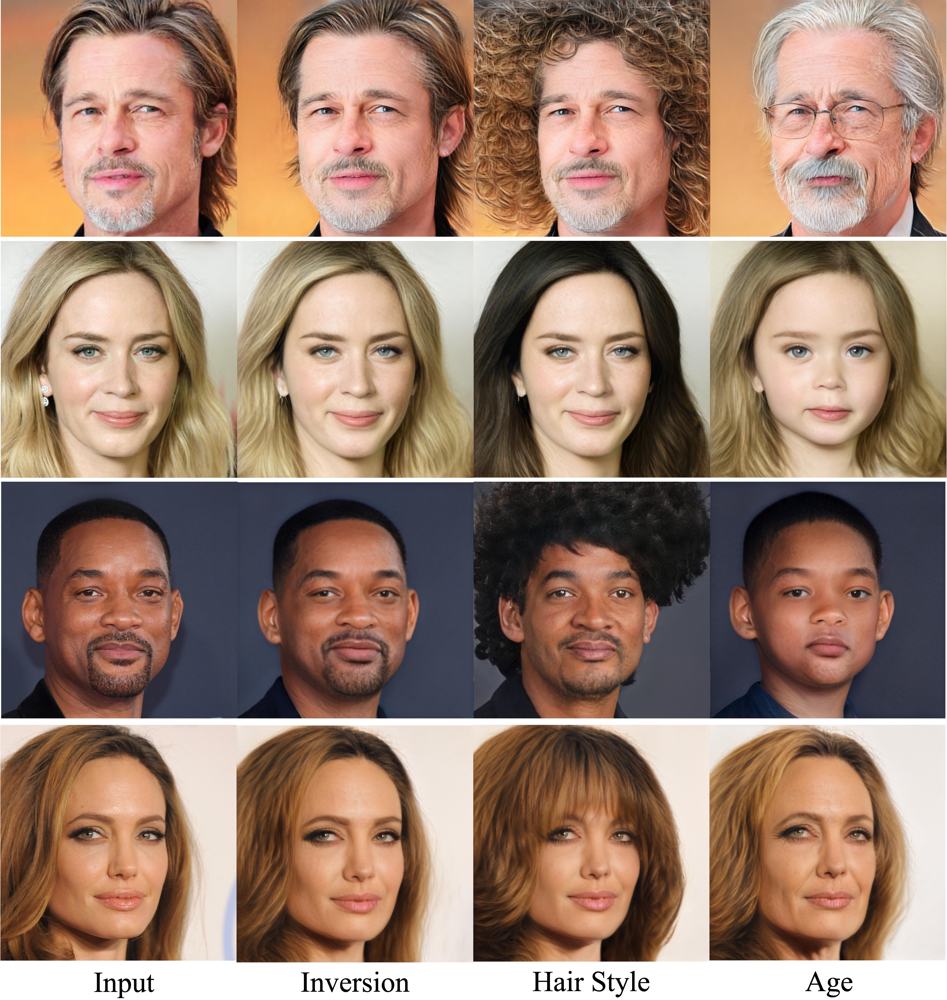
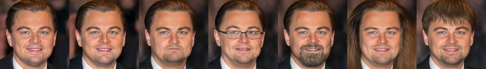
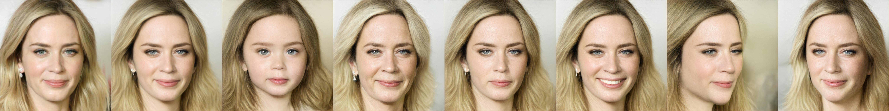
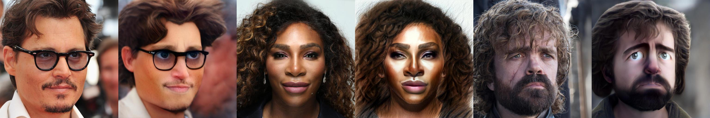

# HyperStyle: StyleGAN Inversion with HyperNetworks for Real Image Editing (CVPR 2022)

> Yuval Alaluf*, Omer Tov*, Ron Mokady, Rinon Gal, Amit H. Bermano  
> *Denotes equal contribution  
> 
> The inversion of real images into StyleGAN's latent space is a well-studied problem. Nevertheless, applying existing approaches to real-world scenarios remains an open challenge, due to an inherent trade-off between reconstruction and editability: latent space regions which can accurately represent real images typically suffer from degraded semantic control. Recent work proposes to mitigate this trade-off by fine-tuning the generator to add the target image to well-behaved, editable regions of the latent space. While promising, this fine-tuning scheme is impractical for prevalent use as it requires a lengthy training phase for each new image. In this work, we introduce this approach into the realm of encoder-based inversion. We propose HyperStyle, a hypernetwork that learns to modulate StyleGAN's weights to faithfully express a given image in editable regions of the latent space. A naive modulation approach would require training a hypernetwork with over three billion parameters. Through careful network design, we reduce this to be in line with existing encoders. HyperStyle yields reconstructions comparable to those of optimization techniques with the near real-time inference capabilities of encoders. Lastly, we demonstrate HyperStyle's effectiveness on several applications beyond the inversion task, including the editing of out-of-domain images which were never seen during training.

<a href="https://arxiv.org/abs/2111.15666"></a>
<a href="https://opensource.org/licenses/MIT"></a>  

<a href="https://youtu.be/_sbXmLY2jMw"></a>  

Inference Notebook: <a href="http://colab.research.google.com/github/yuval-alaluf/hyperstyle/blob/master/notebooks/inference_playground.ipynb"></a>  
Animation Notebook: <a href="http://colab.research.google.com/github/yuval-alaluf/hyperstyle/blob/master/notebooks/animations_playground.ipynb"></a>  
Domain Adaptation Notebook: <a href="http://colab.research.google.com/github/yuval-alaluf/hyperstyle/blob/master/notebooks/domain_adaptation_playground.ipynb"></a>  


<p align="center">
  
<br>
Given a desired input image, our hypernetworks learn to modulate a pre-trained StyleGAN network to achieve accurate image reconstructions in editable regions of the latent space. 
Doing so enables one to effectively apply techniques such as StyleCLIP and InterFaceGAN for editing real images.
</p>

# Description   
Official Implementation of our HyperStyle paper for both training and evaluation. HyperStyle introduces a new approach for learning to efficiently modify a pretrained StyleGAN generator based on a given target image through the use of hypernetworks.

# Table of Contents
- [Getting Started](#getting-started)
  * [Prerequisites](#prerequisites)
  * [Installation](#installation)
- [Pretrained HyperStyle Models](#pretrained-hyperstyle-models)
  * [Auxiliary Models](#auxiliary-models)
    + [Pretrained W-Encoders](#pretrained-w-encoders)
    + [StyleGAN2 Generators](#stylegan2-generators)
    + [Other Utility Models](#other-utility-models)
- [Training](#training)
  * [Preparing your Data](#preparing-your-data)
  * [Preparing your Generator](#preparing-your-generator)
  * [Training HyperStyle](#training-hyperstyle)
    + [Additional Notes](#additional-notes)
    + [Pre-Extracting Initial Inversions](#pre-extracting-initial-inversions)
- [Inference](#inference)
  * [Inference Notebooks](#inference-notebooks)
  * [Inference Script](#inference-script)
  * [Computing Metrics](#computing-metrics)
  * [Editing](#editing)
    + [Editing Faces with InterFaceGAN](#editing-faces-with-interfacegan)
    + [Editing Cars with GanSpace](#editing-cars-with-ganspace)
    + [Editing Faces with StyleCLIP](#editing-faces-with-styleclip)
- [Domain Adaptation](#domain-adaptation)
- [Repository structure](#repository-structure)
- [Related Works](#related-works)
- [Credits](#credits)
- [Acknowledgments](#acknowledgments)
- [Citation](#citation)

# Getting Started
## Prerequisites
- Linux or macOS
- NVIDIA GPU + CUDA CuDNN (CPU may be possible with some modifications, but is not inherently supported)
- Python 3

## Installation
- Dependencies:  We recommend running this repository using [Anaconda](https://docs.anaconda.com/anaconda/install/).  
All dependencies for defining the environment are provided in `environment/hyperstyle_env.yaml`.

<br>

# Pretrained HyperStyle Models
In this repository, we provide pretrained HyperStyle models for various domains.  
All models make use of a modified, pretrained [e4e encoder](https://github.com/omertov/encoder4editing) for obtaining an initial inversion into the W latent space.

Please download the pretrained models from the following links.

| Path | Description
| :--- | :----------
|[Human Faces](https://drive.google.com/file/d/1C3dEIIH1y8w1-zQMCyx7rDF0ndswSXh4/view?usp=sharing)  | HyperStyle trained on the [FFHQ](https://github.com/NVlabs/ffhq-dataset) dataset.
|[Cars](https://drive.google.com/file/d/1WZ7iNv5ENmxXFn6dzPeue1jQGNp6Nr9d/view?usp=sharing)  | HyperStyle trained on the [Stanford Cars](https://ai.stanford.edu/~jkrause/cars/car_dataset.html) dataset.
|[Wild](https://drive.google.com/file/d/1OMAKYRp3T6wzGr0s3887rQK-5XHlJ2gp/view?usp=sharing)  | HyperStyle trained on the [AFHQ Wild](https://github.com/clovaai/stargan-v2) dataset.


## Auxiliary Models
In addition, we provide various auxiliary models needed for training your own HyperStyle models from scratch.  
These include the pretrained e4e encoders into W, pretrained StyleGAN2 generators, and models used for loss computation.

<br>

### Pretrained W-Encoders
| Path | Description
| :--- | :----------
|[Faces W-Encoder](https://drive.google.com/file/d/1M-hsL3W_cJKs77xM1mwq2e9-J0_m7rHP/view?usp=sharing) | Pretrained e4e encoder trained on FFHQ into the W latent space.
|[Cars W-Encoder](https://drive.google.com/file/d/1GZke8pfXMSZM9mfT-AbP1Csyddf5fas7/view?usp=sharing) | Pretrained e4e encoder trained on Stanford Cars into the W latent space.
|[Wild W-Encoder](https://drive.google.com/file/d/1MhEHGgkTpnTanIwuHYv46i6MJeet2Nlr/view?usp=sharing) | Pretrained e4e encoder trained on AFHQ Wild into the W latent space.

<br>

### StyleGAN2 Generators
| Path | Description
| :--- | :----------
|[FFHQ StyleGAN](https://drive.google.com/file/d/1EM87UquaoQmk17Q8d5kYIAHqu0dkYqdT/view?usp=sharing) | StyleGAN2 model trained on FFHQ with 1024x1024 output resolution.
|[LSUN Car StyleGAN](https://drive.google.com/file/d/1UmMHHB3DU1trTB8_9Fjkck5ZwArnD81B/view?usp=sharing) | StyleGAN2 model trained on LSUN Car with 512x384 output resolution.
|[AFHQ Wild StyleGAN](https://drive.google.com/file/d/1z6IVVaCJuFTksKwp1CM3emWOVHbrBip-/view?usp=sharing) | StyleGAN-ADA model trained on AFHQ Wild with 512x512 output resolution.
|[Toonify](https://drive.google.com/file/d/1r3XVCt_WYUKFZFxhNH-xO2dTtF6B5szu/view?usp=sharing) | Toonify generator from Doron Adler and Justin Pinkney converted to Pytorch using rosinality's conversion script, used in domain adaptation.
|[Pixar](https://drive.google.com/file/d/1trPW-To9L63x5gaXrbAIPkOU0q9f_h05/view?usp=sharing) | Pixar generator from StyleGAN-NADA used in domain adaptation.

Note: all StyleGAN models are converted from the official TensorFlow models to PyTorch using the conversion script from [rosinality](https://github.com/rosinality/stylegan2-pytorch).

<br>

### Other Utility Models
| Path | Description
| :--- | :----------
|[IR-SE50 Model](https://drive.google.com/file/d/1KW7bjndL3QG3sxBbZxreGHigcCCpsDgn/view?usp=sharing) | Pretrained IR-SE50 model taken from [TreB1eN](https://github.com/TreB1eN/InsightFace_Pytorch) for use in our ID loss and encoder backbone on human facial domain.
|[ResNet-34 Model](https://download.pytorch.org/models/resnet34-333f7ec4.pth) | ResNet-34 model trained on ImageNet taken from [torchvision](https://github.com/pytorch/vision/blob/master/torchvision/models/resnet.py) for initializing our encoder backbone.
|[MoCov2 Model](https://drive.google.com/file/d/18rLcNGdteX5LwT7sv_F7HWr12HpVEzVe/view) | Pretrained ResNet-50 model trained using MOCOv2 for computing MoCo-based loss on non-facial domains. The model is taken from the [official implementation](https://github.com/facebookresearch/moco).
|[CurricularFace Backbone](https://drive.google.com/file/d/1f4IwVa2-Bn9vWLwB-bUwm53U_MlvinAj/view?usp=sharing) | Pretrained CurricularFace model taken from [HuangYG123](https://github.com/HuangYG123/CurricularFace) for use in ID similarity metric computation.
|[MTCNN](https://drive.google.com/file/d/1tJ7ih-wbCO6zc3JhI_1ZGjmwXKKaPlja/view?usp=sharing) | Weights for MTCNN model taken from [TreB1eN](https://github.com/TreB1eN/InsightFace_Pytorch) for use in ID similarity metric computation. (Unpack the tar.gz to extract the 3 model weights.)

By default, we assume that all auxiliary models are downloaded and saved to the directory `pretrained_models`. 
However, you may use your own paths by changing the necessary values in `configs/path_configs.py`. 

<br>
<br>

# Training

## Preparing your Data
In order to train HyperStyle on your own data, you should perform the following steps: 
1. Update `configs/paths_config.py` with the necessary data paths and model paths for training and inference.
```
dataset_paths = {
    'train_data': '/path/to/train/data'
    'test_data': '/path/to/test/data',
}
```
2. Configure a new dataset under the `DATASETS` variable defined in `configs/data_configs.py`. There, you should define the source/target data paths for the train and test sets as well as the transforms to be used for training and inference.
```
DATASETS = {
	'my_hypernet': {
		'transforms': transforms_config.EncodeTransforms,   # can define a custom transform, if desired
		'train_source_root': dataset_paths['train_data'],
		'train_target_root': dataset_paths['train_data'],
		'test_source_root': dataset_paths['test_data'],
		'test_target_root': dataset_paths['test_data'],
	}
}
```
3. To train with your newly defined dataset, simply use the flag `--dataset_type my_hypernet`.

<br>

## Preparing your Generator
In this work, we use rosinality's [StyleGAN2 implementation](https://github.com/rosinality/stylegan2-pytorch). 
If you wish to use your own generator trained using NVIDIA's implementation there are a few options we recommend:
1. Using NVIDIA's StyleGAN2 / StyleGAN-ADA TensorFlow implementation.  
   You can then convert the TensorFlow `.pkl` checkpoints to the supported format using the conversion script found in [rosinality's implementation](https://github.com/rosinality/stylegan2-pytorch#convert-weight-from-official-checkpoints).
2. Using NVIDIA's StyleGAN-ADA PyTorch implementation.  
   You can then convert the PyTorch `.pkl` checkpoints to the supported format using the conversion script created by [Justin Pinkney](https://github.com/justinpinkney) found in [dvschultz's fork](https://github.com/dvschultz/stylegan2-ada-pytorch/blob/main/SG2_ADA_PT_to_Rosinality.ipynb).  

Once you have the converted `.pt` files, you should be ready to use them in this repository.  

<br>

## Training HyperStyle
The main training script can be found in `scripts/train.py`.  
Intermediate training results are saved to `opts.exp_dir`. This includes checkpoints, train outputs, and test outputs.  
Additionally, if you have tensorboard installed, you can visualize tensorboard logs in `opts.exp_dir/logs`. 

Training HyperStyle with the settings used in the paper can be done by running the following command. Here, we provide an example for training on the human faces domain:

```
python scripts/train.py \
--dataset_type=ffhq_hypernet \
--encoder_type=SharedWeightsHyperNetResNet \
--exp_dir=experiments/hyperstyle \
--workers=8 \
--batch_size=8 \
--test_batch_size=8 \
--test_workers=8 \
--val_interval=5000 \
--save_interval=10000 \
--lpips_lambda=0.8 \
--l2_lambda=1 \
--id_lambda=0.1 \
--n_iters_per_batch=5 \
--max_val_batches=150 \
--output_size=1024 \
--load_w_encoder \
--w_encoder_checkpoint_path pretrained_models/faces_w_encoder \ 
--layers_to_tune=0,2,3,5,6,8,9,11,12,14,15,17,18,20,21,23,24
```
  

### Additional Notes
- To select which generator layers to tune with the hypernetwork, you can use the `--layers_to_tune` flag.
    - By default, we will alter all non-toRGB convolutional layers. 
- ID/similarity losses: 
    - For the human facial domain we use a specialized ID loss based on a pretrained ArcFace network. This is set using the flag `--id_lambda=0.1`.
    - For all other domains, please set `--id_lambda=0` and `--moco_lambda=0.5` to use the MoCo-based similarity loss from Tov et al. 
        - Note, you __cannot__ set both `id_lambda` and `moco_lambda` to be active simultaneously.
- You should also adjust the `--output_size` and `--stylegan_weights` flags according to your StyleGAN generator. 
- To use the HyperStyle with Refinement Blocks based on separable convolutions (see the ablation study), you can set the `encoder_type` to `SharedWeightsHyperNetResNetSeparable`.
- See `options/train_options.py` for all training-specific flags. 

<br> 

### Pre-Extracting Initial Inversions
To provide a small speed-up and slightly reduce memory consumption, we could pre-extract all the latents and inversions from our W-encoder rather than inverting on the fly during training.   
We provide an example for how to do this in `configs/data_configs.py` under the `ffhq_hypernet_pre_extract` dataset.  
Here, we must define: 
- `train_source_root`: the directory holding all the initial inversions
- `train_target_root`: the directory holding all target images (i.e., original images)
- `train_latents_path`: the `.npy` file holding the latents for the inversions 
    of the form  
    ```latents = { "0.jpg": latent, "1.jpg": latent, ... }```.

And similarly for the test dataset.  

Performing the above and pre-extracting the latents and inversions could also allow you to train HyperStyle using latents from various encoders such as pSp, e4e, and ReStyle into W+ rather than using our pretrained encoder into W.

During training, we will use the `LatentsImagesDataset` for loading the inversion, latent code, and target image. 

<br>

# Inference

## Inference Notebooks
To help visualize the results of ReStyle we provide a Jupyter notebook found in `notebooks/inference_playground.ipynb`.   
The notebook will download the pretrained models and run inference on the images found in `notebooks/images` or on images of your choosing. It is recommended to run this in [Google Colab](http://colab.research.google.com/github/yuval-alaluf/hyperstyle/blob/master/notebooks/inference_playground.ipynb).

We have also provided a notebook for generating interpolation videos such as those found in the project page. This 
notebook can be run using Google Colab [here](http://colab.research.google.com/github/yuval-alaluf/hyperstyle/blob/master/notebooks/animations_playground.ipynb).

<br>

## Inference Script
You can use `scripts/inference.py` to apply a trained HyperStyle model on a set of images:
```
python scripts/inference.py \
--exp_dir=/path/to/experiment \
--checkpoint_path=experiment/checkpoints/best_model.pt \
--data_path=/path/to/test_data \
--test_batch_size=4 \
--test_workers=4 \
--n_iters_per_batch=5 \
--load_w_encoder \
--w_encoder_checkpoint_path /path/to/w_encoder.pt
```
This script will save each step's outputs in a separate sub-directory (e.g., the outputs of step `i` will be saved in `/path/to/experiment/inference_results/i`). In addition, 
side-by-side reconstruction results will be saved to `/path/to/experiment/inference_coupled`.

Notes: 
- By default, the images will be saved at their original output resolutions (e.g., `1024x1024` for faces, `512x384` for cars).
    - If you wish to save outputs resized to resolutions of `256x256` (or `256x192` for cars), you can do so by adding the flag `--resize_outputs`.
- This script will also save all the latents as an `.npy` file in a dictionary format as follows: 
    - ```latents = { "0.jpg": latent, "1.jpg": latent, ... }```
- In addition, by setting the flag `--save_weight_deltas`, we will save the final predicted weight deltas for each image.  
    - These will be saved as `.npy` files in the sub-directory `weight_deltas`.
    - Setting this flag is important if you would like to apply them for some down-stream task. For example, if you would like apply them for editing using StyleCLIP (see below).

<br>

## Computing Metrics
Given a trained model and generated outputs, we can compute the loss metrics on a given dataset.  
These scripts receive the inference output directory and ground truth directory.
```
python scripts/calc_losses_on_images.py \
--metrics lpips,l2,msssim \
--output_path=/path/to/experiment/inference_results \
--gt_path=/path/to/test_images
```
Here, we can compute multiple metrics using a comma-separated list with the flag `--metrics`.

Similarly, to compute the ID similarity: 
```
python scripts/calc_losses_on_images.py \
--output_path=/path/to/experiment/inference_results \
--gt_path=/path/to/test_images
```

These scripts will traverse through each sub-directory of `output_path` to compute the metrics on each step's output images.

<br>

## Editing
<p align="center">



<br>
Editing results obtained via HyperStyle using StyleCLIP, InterFaceGAN, and GanSpace, respectively.
</p>

For performing inference and editing using InterFaceGAN (for faces) and GANSpace (for cars), you can run `editing/inference_face_editing.py` and `editing/inference_cars_editing.py`.

<br>

### Editing Faces with InterFaceGAN
```
python editing/inference_face_editing.py \
--exp_dir=/path/to/experiment \
--checkpoint_path=experiment/checkpoints/best_model.pt \
--data_path=/path/to/test_data \
--test_batch_size=4 \
--test_workers=4 \
--n_iters_per_batch=3 \
--edit_directions=age,pose,smile \
--factor_range=5 \
----load_w_encoder
```
For InterFaceGAN we currently support edits of age, pose, and smile. 

<br>

### Editing Cars with GanSpace
```
python editing/inference_cars_editing.py \
--exp_dir=/path/to/experiment \
--checkpoint_path=experiment/checkpoints/best_model.pt \
--data_path=/path/to/test_data \
--test_batch_size=4 \
--test_workers=4 \
--n_iters_per_batch=3
```
For GANSpace we currently support edits of pose, cube, color, and grass.

These scripts will perform the inversion immediately followed by the latent space edit.  
For each image, we save the original image followed by the inversion and the resulting edits.  

<br>

### Editing Faces with StyleCLIP 
In addition, we support editing with StyleCLIP's global directions approach on the human faces domain. Editing can be performed by running `editing/styleclip/edit.py`. For example,
```
python editing/styleclip/edit.py \
--exp_dir /path/to/experiment \   
--weight_deltas_path /path/to/experiment/weight_deltas \
--neutral_text "a face" \
--target_tex "a face with a beard" \
```
**Note:** before running the above script, you need to install the official CLIP package:
```
pip install git+https://github.com/openai/CLIP.git
``` 

**Note:** we assume that `latents.npy` and the directory `weight_deltas`, obtained by running 
`inference.py` are both saved in the the given `exp_dir`.  
For each input image we save a grid of results with different values of `alpha` and `beta` as defined in StyleCLIP.  

<br>

# Domain Adaptation
<p align="center">

<br>
Domain adaptation results obtained via HyperStyle by applying the learned weight offsets to various fine-tuned generators.
</p>

In `scripts/run_domain_adaptation.py`, we provide a script for performing domain adaptation from the FFHQ domain to another (e.g., toons or sketches).
Specifically, using a HyperStyle network trained on FFHQ, we can predict the weight offsets for a given input image. 
We can then apply the predicted weight offsets to a fine-tuned generator to obtain a translated image that better preserves the input image.

A example command is provided below: 
```
python scripts/run_domain_adaptation.py \
--exp_dir /path/to/experiment \   
--checkpoint_path=experiment/checkpoints/best_model.pt \
--data_path=/path/to/test_data \
--test_batch_size=4 \
--test_workers=4 \
--load_w_encoder \
--w_encoder_checkpoint_path=pretrained_models/faces_w_encoder.pt \
--restyle_checkpoint_path=pretrained_models/restyle_e4e_ffhq_encode.pt \
--finetuned_generator_checkpoint_path=pretrained_models/pixar.pt \
--n_iters_per_batch=2 \
--restyle_n_iterations=2
```

Here, since we are performing a translation to a new domain, we recommend setting the number of iterations to a small number (e.g., 2-3).  

Below we provide links the pre-trained ReStyle-e4e network and various fine-tuned generators. 

| Path | Description
| :--- | :----------
|[FFHQ ReStyle e4e](https://drive.google.com/file/d/1e2oXVeBPXMQoUoC_4TNwAWpOPpSEhE_e/view?usp=sharing) | ReStyle e4e trained on FFHQ with 1024x1024 output resolution.
|[Toonify](https://drive.google.com/file/d/1r3XVCt_WYUKFZFxhNH-xO2dTtF6B5szu/view?usp=sharing) | Toonify generator from Doron Adler and Justin Pinkney converted to Pytorch using rosinality's conversion script, used in domain adaptation.
|[Pixar](https://drive.google.com/file/d/1trPW-To9L63x5gaXrbAIPkOU0q9f_h05/view?usp=sharing) | Pixar generator from StyleGAN-NADA used in domain adaptation.
|[Sketch](https://drive.google.com/file/d/1aHhzmxT7eD90txAN93zCl8o9CUVbMFnD/view?usp=sharing) | Sketch generator from StyleGAN-NADA used in domain adaptation.
|[Disney Princess](https://drive.google.com/file/d/1rXHZu4Vd0l_KCiCxGbwL9Xtka7n3S2NB/view?usp=sharing) | Disney princess generator from StyleGAN-NADA used in domain adaptation.


<br>

# Repository structure
| Path | Description 
| :--- | :---
| hyperstyle | Repository root folder
| &boxvr;&nbsp; configs | Folder containing configs defining model/data paths and data transforms
| &boxvr;&nbsp; criteria | Folder containing various loss criterias for training
| &boxvr;&nbsp; datasets | Folder with various dataset objects
| &boxvr;&nbsp; docs | Folder containing images displayed in the README
| &boxvr;&nbsp; environment | Folder containing Anaconda environment used in our experiments
| &boxvr;&nbsp; editing | Folder containing scripts for applying various editing techniques
| &boxvr;&nbsp; licenses | Folder containing licenses of the open source projects used in this repository
| &boxvr; models | Folder containing all the models and training objects
| &boxv;&nbsp; &boxvr;&nbsp; encoders | Folder containing various encoder architecture implementations such as the W-encoder, pSp, and e4e
| &boxv;&nbsp; &boxvr;&nbsp; hypernetworks | Implementations of our hypernetworks and Refinement Blocks
| &boxv;&nbsp; &boxvr;&nbsp; mtcnn | MTCNN implementation from [TreB1eN](https://github.com/TreB1eN/InsightFace_Pytorch)
| &boxv;&nbsp; &boxvr;&nbsp; stylegan2 | StyleGAN2 model from [rosinality](https://github.com/rosinality/stylegan2-pytorch)
| &boxv;&nbsp; &boxvr;&nbsp; hyperstyle.py | Main class for our HyperStyle network
| &boxvr;&nbsp; notebooks | Folder with jupyter notebooks containing HyperStyle inference playgrounds
| &boxvr;&nbsp; options | Folder with training and test command-line options
| &boxvr;&nbsp; scripts | Folder with running scripts for training, inference, and metric computations
| &boxvr;&nbsp; training | Folder with main training logic and Ranger implementation from [lessw2020](https://github.com/lessw2020/Ranger-Deep-Learning-Optimizer)
| &boxvr;&nbsp; utils | Folder with various utility functions
|  | 

# Related Works 
Many GAN inversion techniques focus on finding a latent code that most accurately reconstructs a given image using a fixed, pre-trained generator. These works include encoder-based approaches such as [pSp](https://github.com/eladrich/pixel2style2pixel), [e4e](https://github.com/omertov/encoder4editing) and [ReStyle](https://github.com/yuval-alaluf/restyle-encoder), and optimization techniques such as those from [Abdal et al.](https://arxiv.org/abs/1904.03189) and [Zhu et al.](https://arxiv.org/abs/2012.09036), among many others.

In contrast, HyperStyle learns to modulate the **weights** of a pre-trained StyleGAN using a hypernetwork to achieve more accurate reconstructions. Previous generator tuning approaches performed a per-image optimization for fine-tuning the generator weights ([Roich et. al](https://github.com/danielroich/PTI)) or feature activations ([Bau et al.](https://arxiv.org/abs/2005.07727)).

Given our inversions we can apply off-the-shelf editing techniques such as [StyleCLIP](https://github.com/orpatashnik/StyleCLIP), [InterFaceGAN](https://github.com/genforce/interfacegan), and [GANSpace](https://github.com/harskish/ganspace), even on the modified generator.  

Finally, we can apply weight offsets learned on HyperStyle trained on FFHQ to fine-tuned generators such as those obtained from [StyleGAN-NADA](https://github.com/rinongal/StyleGAN-nada), resulting in more faithful translations.

# Credits
**StyleGAN2 model and implementation:**  
https://github.com/rosinality/stylegan2-pytorch  
Copyright (c) 2019 Kim Seonghyeon  
License (MIT) https://github.com/rosinality/stylegan2-pytorch/blob/master/LICENSE  

**IR-SE50 model and implementations:**  
https://github.com/TreB1eN/InsightFace_Pytorch  
Copyright (c) 2018 TreB1eN  
License (MIT) https://github.com/TreB1eN/InsightFace_Pytorch/blob/master/LICENSE  

**Ranger optimizer implementation:**  
https://github.com/lessw2020/Ranger-Deep-Learning-Optimizer   
License (Apache License 2.0) https://github.com/lessw2020/Ranger-Deep-Learning-Optimizer/blob/master/LICENSE  

**LPIPS model and implementation:**  
https://github.com/S-aiueo32/lpips-pytorch  
Copyright (c) 2020, Sou Uchida  
License (BSD 2-Clause) https://github.com/S-aiueo32/lpips-pytorch/blob/master/LICENSE  

**pSp model and implementation:**   
https://github.com/eladrich/pixel2style2pixel  
Copyright (c) 2020 Elad Richardson, Yuval Alaluf  
License (MIT) https://github.com/eladrich/pixel2style2pixel/blob/master/LICENSE

**e4e model and implementation:**   
https://github.com/omertov/encoder4editing  
Copyright (c) 2021 omertov   
License (MIT) https://github.com/omertov/encoder4editing/blob/main/LICENSE

**ReStyle model and implementation:**  
https://github.com/yuval-alaluf/restyle-encoder  
Copyright (c) 2021 Yuval Alaluf    
License (MIT) https://github.com/yuval-alaluf/restyle-encoder/blob/main/LICENSE

**StyleCLIP implementation:**  
https://github.com/orpatashnik/StyleCLIP   
Copyright (c) 2021 Or Patashnik, Zongze Wu  
https://github.com/orpatashnik/StyleCLIP/blob/main/LICENSE  

**StyleGAN-NADA models:**  
https://github.com/rinongal/StyleGAN-nada   
Copyright (c) 2021 rinongal  
https://github.com/rinongal/StyleGAN-nada/blob/main/LICENSE  


**Please Note**: The CUDA files under the [StyleGAN2 ops directory](https://github.com/yuval-alaluf/hyperstyle/tree/master/models/stylegan2/op) are made available under the [Nvidia Source Code License-NC](https://nvlabs.github.io/stylegan2/license.html)

# Acknowledgments
This code borrows from [pixel2style2pixel](https://github.com/eladrich/pixel2style2pixel), 
[encoder4editing](https://github.com/omertov/encoder4editing), and [ReStyle](https://github.com/yuval-alaluf/restyle-encoder).


# Citation
If you use this code for your research, please cite the following work:
```
@misc{alaluf2021hyperstyle,
      title={HyperStyle: StyleGAN Inversion with HyperNetworks for Real Image Editing}, 
      author={Yuval Alaluf and Omer Tov and Ron Mokady and Rinon Gal and Amit H. Bermano},
      year={2021},
      eprint={2111.15666},
      archivePrefix={arXiv},
      primaryClass={cs.CV}
}
```
